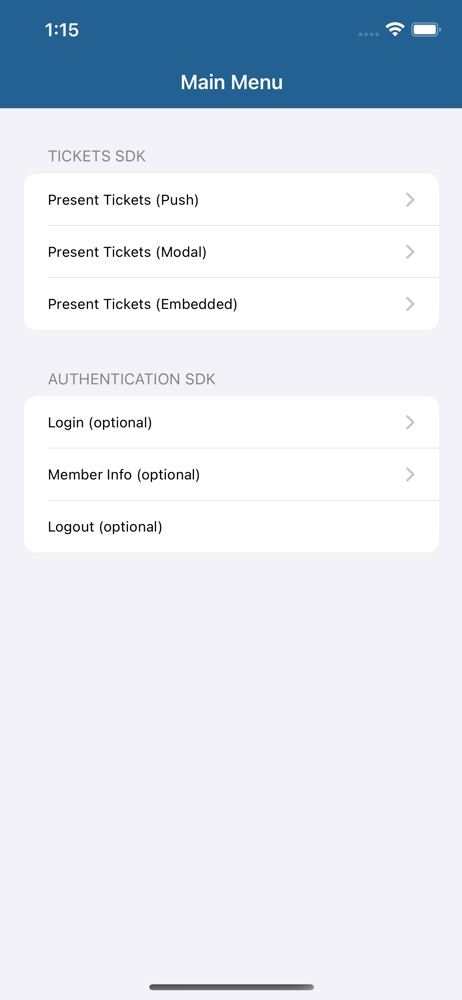
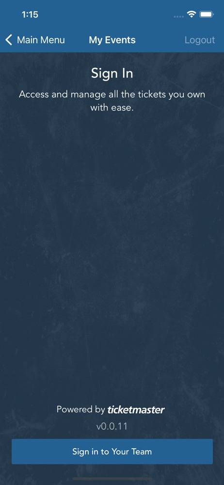
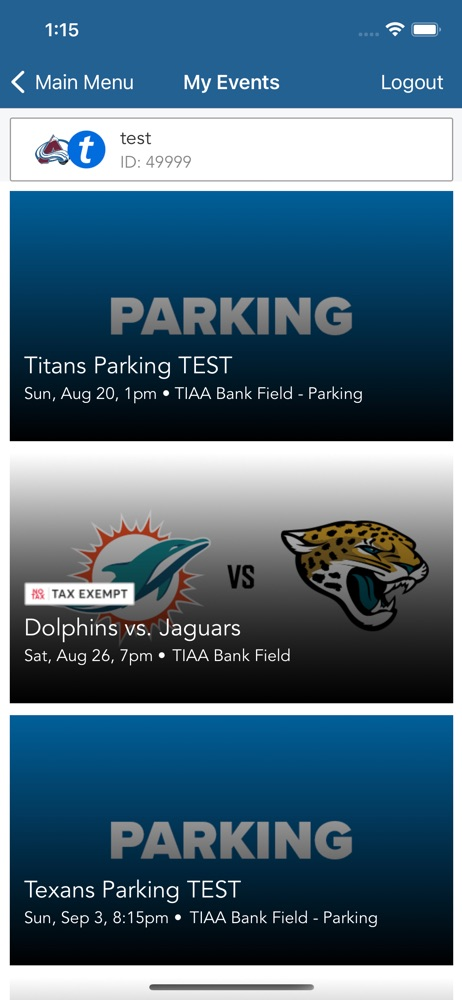
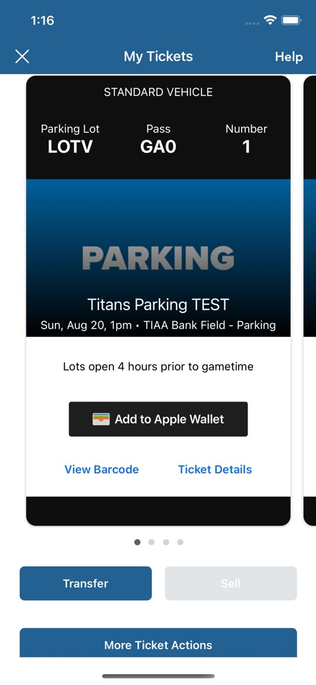
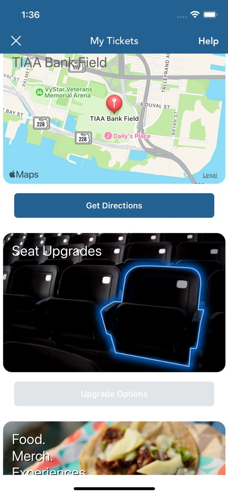

# iOS Tickets SDK Application Integration Demo

This is an example integration of the Ticketmaster Ignite SDK, Tickets framework.

* Documentation: https://ignite.ticketmaster.com/docs/tickets-sdk-overview
* Frameworks: https://github.com/ticketmaster/iOS-IgniteSDK
* Source: https://github.com/ticketmaster/iOS-TicketsDemoApp

## Demo App Screenshots

   

## Getting Started

1. Open **TicketsSDKDemoIntegration.xcodeproj** in Xcode 14.3+
   1. This will also download the required .xcframeworks using Swift Package Manager
2. Update **Configuration.swift** with your own API key, available from [https://developer.ticketmaster.com/explore/](https://developer.ticketmaster.com/explore/)
3. Update **TicketsSDKDemoIntegration** target's _Signing & Capabilities_ with your own Apple Developer certificate from [https://developer.apple.com/](https://developer.apple.com/)
4. Build and Run **TicketsSDKDemoIntegration** target

# Example Code

## Configuration

1. Update your API key and branding colors in _Configuration.Swift_

2. Authentication SDK is configured using settings from _Configuration.Swift_

3. Tickets SDK inherits it's configuration from Authentication SDK

A basic example of this is provided in _MainMenuVC+Config.swift_

## Presentation

There are 3 different ways to present the Tickets SDK:
* **Push** on Navigation stack (requires a UINavigationController in your app)
* **Modal** presentation on top of your own UIViewController (easiest to integrate)
* **Embedded** presentation within your own UIViewController (hardest to integrate)

Select the presentation method that best matches how you wish to present Tickets SDK within your own application.

Basic examples of all 3 methods is provided in _MainMenuVC+TableViewDelegate_

## Authentication

While not required, your application may want to control login-related processes directly.

* **Login**
* **Member Info**
* **Logout**

Tickets SDK handles Login/Logout on it's own, so there is no need for you to manually call any of these methods.

However, basic examples of calling Login, MemberInfo, or Logout have been provided in  _MainMenuVC+TableViewDelegate_.

## Information

While not required, your application may want to be informed of operations and use behavior with Authentication and Tickets SDKs.

This information is provided via delegate protocols, basic examples are provided.

* **TMTicketsOrderDelegate**: optional delegate to be informed of non-analytics User-actions
    - see: _MainMenuVC+OrderDelegate.swift_
* **TMTicketsAnalyticsDelegate**: optional delegate to be informed of User behavior
    - see: _MainMenuVC+AnalyticsDelegate.swift_
* **TMAuthenticationDelegate**: optional delegate to recieve login state change information
    - see: _MainMenuVC+AuthDelegate.swift_

## Custom Modules

While not required, your application may want to use Prebuilt Modules or even create your Custom Modules to display underneath the Tickets on the Tickets Listing page.

* **TMTicketsModuleDelegate**: optional delegate to implement prebuilt and custom _TMTicketsModule_ to be rendered on the Tickets listing page
    - see: _MainMenuVC+ModuleDelegate.swift_
